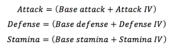
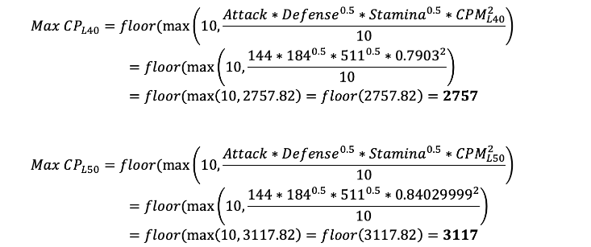

# Go Battle Ninja
Pokemon Go team builder, training and simulation tool for players who need access to pertinent information related to battling. Enjoy this information and training system that will allow users to calculate IV's as well as study league rankings, "fast-move timing" mechanics, Charge Move Priority(CMP), and battle simulations. This program will soon be able to generate teams and strategies FOR YOU; to help improve your knowledge, skills and performance in this part of the game. 

# Table of Contents
- [Background](#background)
- [Contributing](#contributing)
    - [Overall](#overall)
    - [C# Style](#c#-style)
    - [HTML Style](#html-style)
    - [JavaScript Style](#javascript-style)
    - [SQL Style](#sql-style)
    - [Git](#git)
- [Credits](#credits)
- [Access](#access)
- [Team Rules](#team-rules)
- [Tools](#tools)
- [License](#license)

# Background
Pokemon IV's, Charge move Priority and Fast-move timing are hard concepts to understand as a beginner or casual pokemon go player. I wanted to know whether I needed my Scrafty for ultra league to be XL'd or "Best Buddies". The process to get the answer to this question was complicated so I decided to create an information and training hub that provides easy access to pokemon data, trends and knowledge that otherwise may be rather... difficult to find. 

### Technical Resources:
- <a href="https://github.com/pvpoke/pvpoke">PVPoke</a> - json endpoints for league rankings
- <a href="https://pokeapi.co/">PokeAPI</a> - current pokemon go data
- <a href="https://github.com/PokeMiners">PokeMiners</a> - pokemon go assets and the most recent gamemaster json
- Pokemon Stat product algorythm

# Contributing
## Overall
- Follow MVC: Model, View, Controller
- Controllers and Models written in C#
- Views Written in HTML, Javascript, and CSS
- Add comments where code might be confusing or to help others understand its purpose
    
## C# Style
- Curly braces on their own line
- variable names in camel case, no '_' in between words  - "variableName"
- Class names must start with a capital and second word is also capital, no '_' in between words - "ClassName"
- Database context will be named db
    
## HTML Style
- Follow Bootstrap formatting 
- Follow color schema that is chosen in advance
- id names will be camel case - "variableName"

## JavaScript Style
- Function names in camel case - "functionName"
- Variable names in camel case - "variableName"
- Curly braces on their own line

## SQL Style
- Primary keys will be named 'ID'
- Foreign Keys will include the table and ID where it came from - "PokemonID"
- Constraints will be sperated by a '_' - "Pokemon_FK_Matchups"

## GIT
- Use separate feature branches and send a pull request to dev branch.
- Only commit working code (Unless others require your code to help fix a bug) and commit often.
- Write meaningful commit messages.
- Pull the upstream development code and merge it into your feature branch before submitting a Pull Request.
- Pull Request must be made to the dev branch. All other pull requests will be rejected.
- GitHub Repo Master will merge the dev branch into the main branch after Sprint Meetings

# Credits 

- <a href="https://github.com/edgyJackson">Reggie Johnson</a>  

# Access
<a href="https://gobattleninja.azurewebsites.net/#">Website Link</a> - Also Deployed Upon Request!

# Team Rules
- Be Kind
- Work Efficiently

# Tools
- Microsoft Azure
- Identity Framework
- .NET 6
- SQL Server
- C#, HTML, Javascript, CSS
- Continuous Deployment  

# License 
LGPL-3.0-or-later

For more info see <a href="https://github.com/edgyJackson/GoBattleNinja/blob/main/COPYING.LESSER.txt">License.md</a> file

